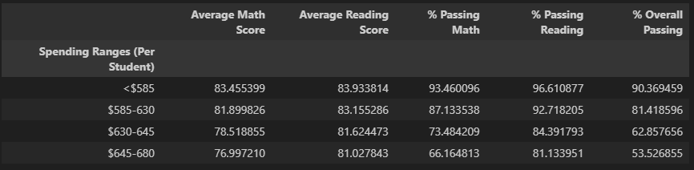
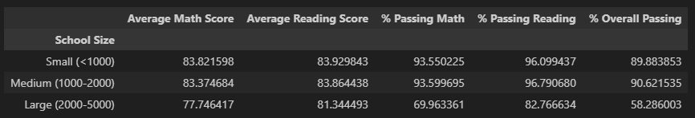
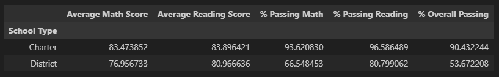

# Analyzing School Data with Pandas
#### Skills Used: Python, Pandas, DataFrames, Merge, GroupBy

## Overview

This analysis looks at the math and reading scores of students at 15 different schools to determine trends in performance. The data is analyzed based on grade-level, school budget, school size, and school type to look for patterns.

In this analysis, we first combined the school data and student data into one dataframe. We used this combined dataframe to calculate certain data points for the entire group of students, including number of students, number of schools, average math score, and average reading score.  We then put this into one summary dataframe.

We then calculated these same metrics for each individual school and placed all of the findings into one dataframe. From this dataframe, we could determine which schools were the highest-performing and which were the lowest-performing.

Then we looked for trends in the data by grouping the information by certain fields, such as school budget, school size, and school type. This was done using the groupby function and the cut function in Pandas to create additional dataframes.

## Conclusions

Overall, schools with smaller budgets (<$585 per student) actually had the highest math and reading scores and the highest overall passing rate as compared to schools with larger budgets.

Larger schools (2000-5000 students) had significantly lower math scores, reading scores, and passing rates as compared to small and medium schools. Small and medium sized-schools were fairly equal in these categories. Scores and passing rates among grade levels is consistent within each school.

Charter schools had higher passing rates as compared to district schools. While the reading passing rates are closer together, he math passing rate and overall passing rate are notably higher in charter schools.  

